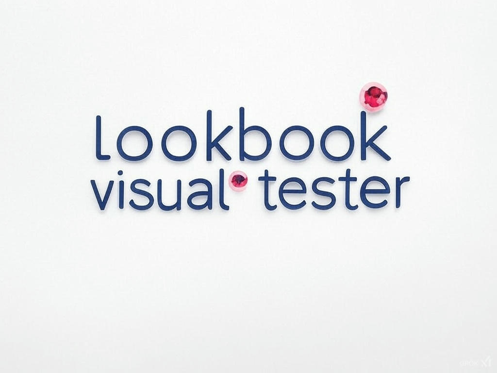

# Lookbook Visual Tester

This gem was built to serve as a lookbook regression tester, getting prints from previews, comparing them and generating a report of differences.


### Features

- Perform visual regression testing on changes.
- Integrate seamlessly with your Lookbook previews.
- Automatically generate image differences.
- Simplify debugging and quality checks.
- Very useful for AI coding (e.g. aider, etc.)

## Installation

Tested on linux. A couple of changes to work on mac, etc. You will need tools like xclip, imagemagick

For Ubuntu-based systems, install the necessary dependencies by running:

```bash
sudo apt-get install xclip imagemagick
```


Install the gem and add to the application's Gemfile by executing:

```bash
bundle add lookbook_visual_tester
```

If bundler is not being used to manage dependencies, install the gem by executing:

```bash
gem install lookbook_visual_tester
```

## Usage

To run everything 
bundle exec rake lookbook_visual_tester:run LOOKBOOK_HOST=https://localhost:5000

### Features 

When installed this gem gets your changes and generates 

## Development

After checking out the repo, run `bin/setup` to install dependencies. Then, run `rake test` to run the tests. You can also run `bin/console` for an interactive prompt that will allow you to experiment.

To install this gem onto your local machine, run `bundle exec rake install`. To release a new version, update the version number in `version.rb`, and then run `bundle exec rake release`, which will create a git tag for the version, push git commits and the created tag, and push the `.gem` file to [rubygems.org](https://rubygems.org).

## Contributing

Bug reports and pull requests are welcome on GitHub at https://github.com/muriloime/lookbook_visual_tester. This project is intended to be a safe, welcoming space for collaboration, and contributors are expected to adhere to the [code of conduct](https://github.com/[USERNAME]/lookbook_visual_tester/blob/main/CODE_OF_CONDUCT.md).


## Deployment 

Generate artifacts for changelog : 

`git log --pretty=format:"%h %ad | %s [%an]" --date=short --no-merges --name-only | xclip -selection clipboard`

Update changelog 
`rake realease`

## Code of Conduct

Everyone interacting in the LookbookVisualTester project's codebases, issue trackers, chat rooms and mailing lists is expected to follow the [code of conduct](https://github.com/[USERNAME]/lookbook_visual_tester/blob/main/CODE_OF_CONDUCT.md).
